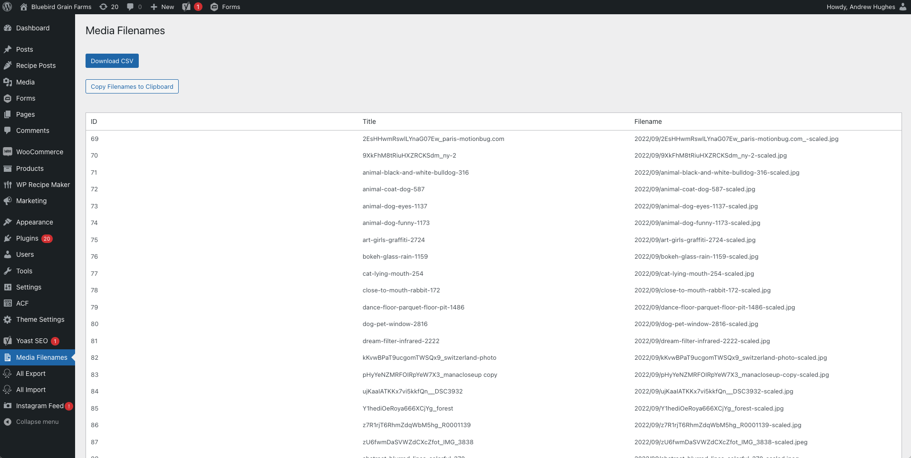

# List Media Filenames

**Contributors:** Your Name
**Tags:** media, filenames, images, admin
**Requires at least:** 5.0
**Tested up to:** 6.2
**Stable tag:** 1.1
**License:** GPLv2 or later
**License URI:** https://www.gnu.org/licenses/gpl-2.0.html

A plugin to list the original file names of all images in the media gallery and provide options to download or copy the list.

## Description

This plugin adds a custom admin page in the WordPress dashboard where you can view a list of all image filenames in your media gallery. You also have options to download the list as a CSV file or copy the filenames to the clipboard.

## Installation

1. Upload the plugin files to the `/wp-content/plugins/list-media-filenames` directory, or install the plugin through the WordPress plugins screen directly.
2. Activate the plugin through the 'Plugins' screen in WordPress.
3. Navigate to the "Media Filenames" page in the WordPress admin menu to view and manage your media filenames.

## Frequently Asked Questions

### How do I download the list of media filenames?

Navigate to the "Media Filenames" page in the WordPress admin menu and click on the "Download CSV" button to download the list as a CSV file.

### How do I copy the filenames to the clipboard?

Navigate to the "Media Filenames" page in the WordPress admin menu and click on the "Copy Filenames to Clipboard" button. An alert will confirm that the filenames have been copied.

## Screenshots

1. **Media Filenames Page:**
   

## Changelog

### 1.1
* Added options to download the list as a CSV file and copy the filenames to the clipboard.

### 1.0
* Initial release of the plugin.

## License

This plugin is licensed under the GPLv2 or later. For more information, see the [GNU General Public License](https://www.gnu.org/licenses/gpl-2.0.html).
